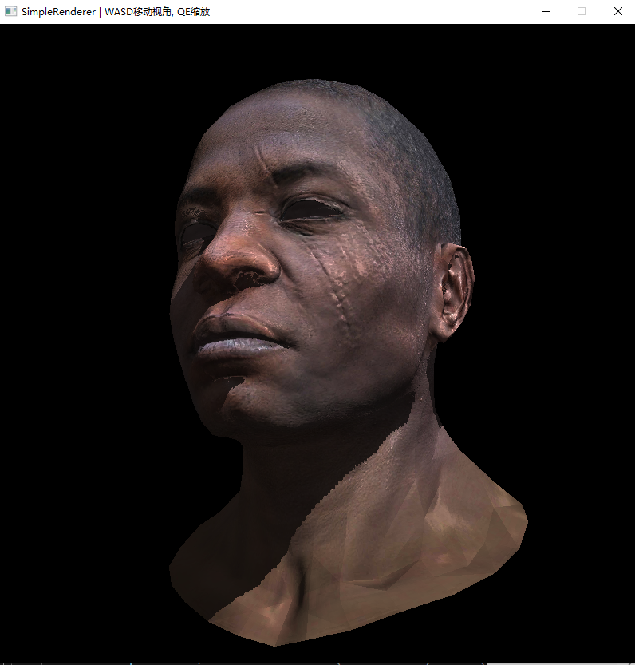
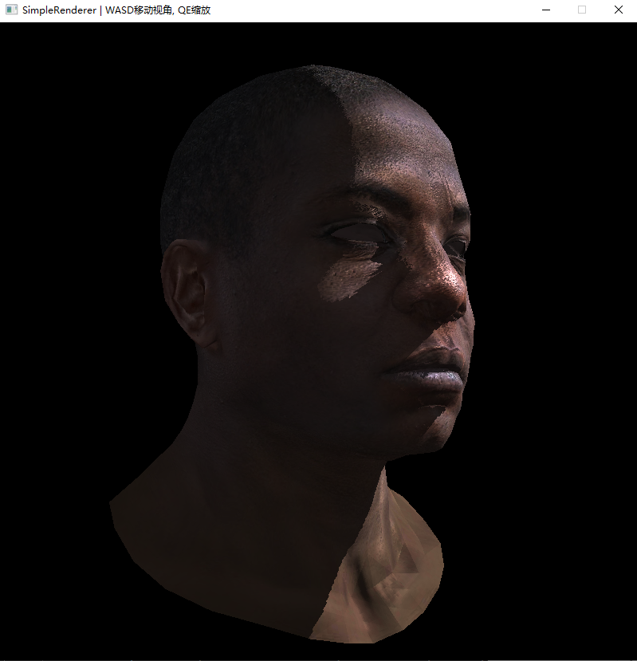
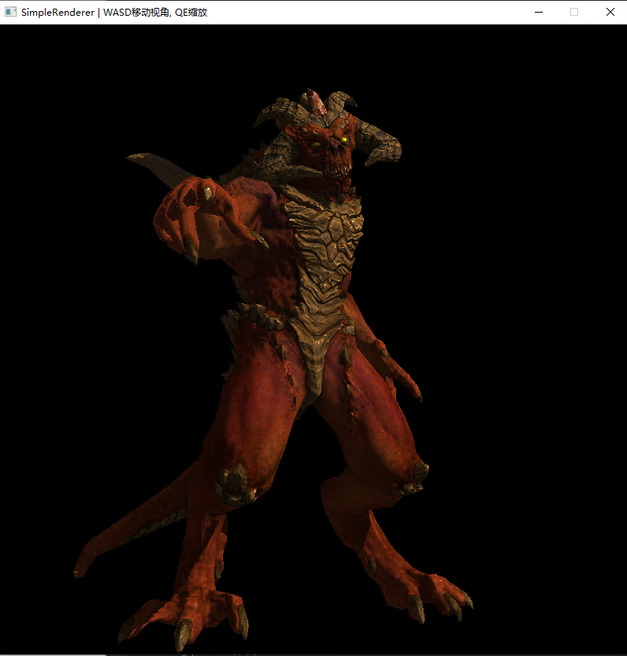

# SimpleRenderer

实现一个windows平台下的可交互软光栅渲染器

### 依赖库

Eigen (向量运算)、windows API (屏幕绘制)

注：VS中配置属性-> C/C++ -> 语言 -> 符合模式需设为否，OpenMP支持需打开

### 主要实现功能：

* Bresenham算法绘制直线
* 三角形绘制
* 深度测试
* 背面剔除
* 坐标变换
* 摄像机模型
* 纹理映射
* Phong光照模型
* 法线贴图
* 高光贴图
* 阴影映射

